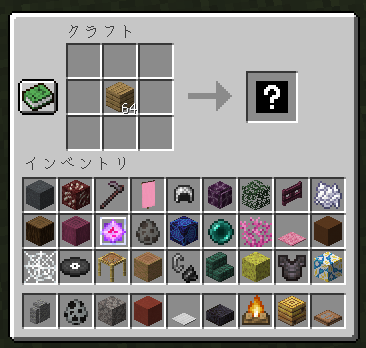

# RandomCraft
[](https://github.com/sya-ri/EasySpigotAPI)

クラフトした時にランダムなアイテムになってしまうプラグイン



## Architecture

クラフトアイテムを変更する方法などを書いています。

[ARCHITECTURE.md](ARCHITECTURE.md)

## Gradle Task

### ktlintFormat
```
gradle ktlintFormat
```

ソースコードを綺麗にすることができます。

### addKtlintFormatGitPreCommitHook
```
gradle addKtlintFormatGitPreCommitHook
```

Git Commit する時に `ktlintFormat` を実行します。やっておくことで必ずフォーマットしてくれるようになるので忘れがちな人にオススメです。

### shadowJar
```
gradle shadowJar
```

Jar ファイルを生成します。`build/libs` フォルダの中に生成されます。